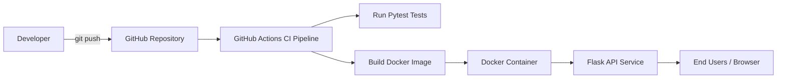

# ACEest Fitness & Gym API – DevOps CI/CD Project

## Project Overview

This project demonstrates a simple **Flask-based REST API** for a fitness and gym management system integrated with a complete **DevOps CI pipeline**.

The application is containerized using **Docker** and automatically tested and built through a CI workflow implemented using **GitHub Actions**.

The project showcases essential DevOps practices including:

- Version control
- Automated testing
- Containerization
- Continuous Integration (CI)

---

## Technologies Used

| Technology     | Purpose                 |
| -------------- | ----------------------- |
| Python         | Application development |
| Flask          | REST API framework      |
| Pytest         | Unit testing framework  |
| Git            | Version control         |
| GitHub         | Code repository         |
| Docker         | Containerization        |
| GitHub Actions | Continuous Integration  |

---

## Project Structure

```
aceest-fitness-ci-cd
│
├── app.py
├── requirements.txt
├── Dockerfile
├── .gitignore
├── README.md
│
├── tests
│   └── test_app.py
│
└── .github
    └── workflows
        └── ci.yml
```

---

## CI/CD Architecture Diagram



---

## CI Pipeline Workflow

The CI pipeline automatically runs when code is pushed to the repository.

Pipeline stages include:

1. **Checkout Repository**
   Downloads the latest source code.

2. **Setup Python Environment**
   Configures Python runtime for the pipeline.

3. **Install Dependencies**

```
pip install -r requirements.txt
```

4. **Run Unit Tests**

```
pytest
```

5. **Build Docker Image**

```
docker build -t aceest-gym .
```

If all steps succeed, the build passes successfully.

---

## Running the Application Locally

### 1. Clone the Repository

```
git clone https://github.com/2024TM93636/aceest-fitness-ci-cd.git
cd aceest-fitness-ci-cd
```

---

### 2. Install Dependencies

```
pip install -r requirements.txt
```

---

### 3. Run the Flask Application

```
python app.py
```

Open browser:

```
http://localhost:5000
```

---

## Running the Application Using Docker

Build the Docker image:

```
docker build -t aceest-gym .
```

Run the container:

```
docker run -p 5000:5000 aceest-gym
```

Access the application:

```
http://localhost:5000
```

---

## Running Tests

Execute unit tests using:

```
pytest
```

---

## Example API Response

Accessing the root endpoint returns:

```
{
  "message": "Welcome to ACEest Fitness & Gym API"
}
```

---

## DevOps Practices Demonstrated

- Source code management with Git
- Automated CI pipeline
- Containerization using Docker
- Automated testing with Pytest
- Cloud-based CI execution with GitHub Actions

---

## Author

Sarath Kumar S
M.Tech – Software Engineering
BITS Pilani (WILP)

---
