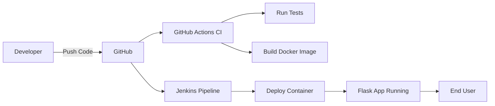
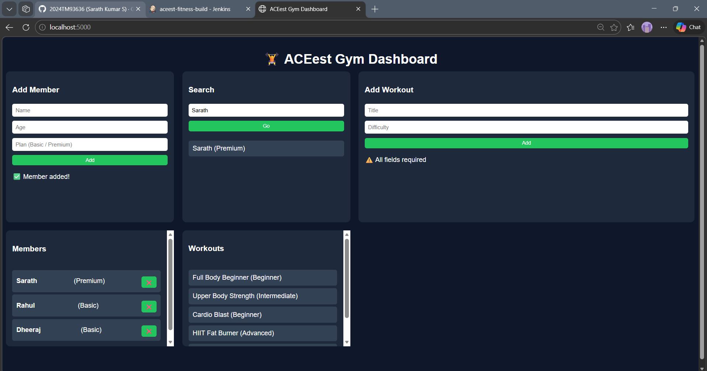
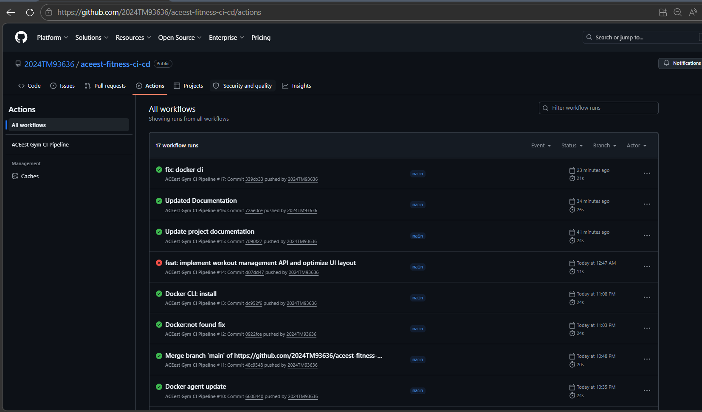
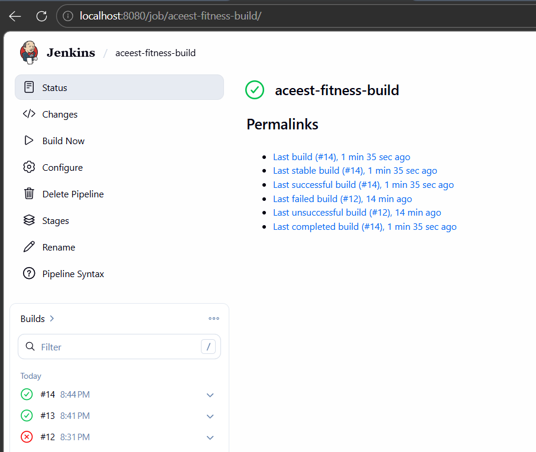
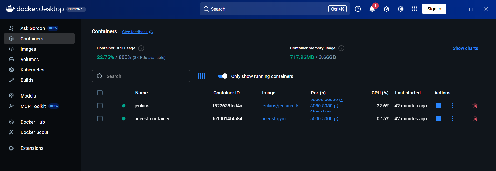

# ACEest Fitness & Gym API – DevOps CI/CD Project


A Flask-based Fitness & Gym Management API demonstrating modern **DevOps practices**, including automated testing, Docker containerization, and CI/CD pipelines with **GitHub Actions** and **Jenkins**.

---

## Table of Contents

- [Academic Context](#academic-context)
- [Overview](#overview)
- [Features](#features)
- [Tech Stack](#tech-stack)
- [Project Structure](#project-structure)
- [API Endpoints](#api-endpoints)
- [Local Setup](#local-setup)
- [Running Tests](#running-tests)
- [Docker Setup](#docker-setup)
- [CI/CD Pipelines](#cicd-pipelines)
- [Workflow Diagram](#cicd-workflow-diagram)
- [Screenshots](#screenshots)
- [DevOps Practices](#devops-practices-implemented)
- [Future Enhancements](#future-enhancements)
- [Author](#author)

---

## Academic Context

This project is developed as part of the **Introduction to DevOps (SEZG514)** course at **BITS Pilani (WILP)**.

It fulfills the assignment requirement of implementing a complete CI/CD pipeline integrating:

- Version Control (GitHub)
- Automated Testing (Pytest)
- Containerization (Docker)
- Continuous Integration (GitHub Actions)
- Continuous Build & Deployment (Jenkins)

---

## Overview

This project implements a **complete DevOps lifecycle** for a fitness application:

1. Local development with Python & Flask
2. Version control using Git & GitHub
3. Unit testing with Pytest
4. Containerization with Docker
5. Continuous Integration via GitHub Actions
6. Continuous Build & Deployment via Jenkins

The goal is to ensure **code quality, environmental consistency, and automated delivery**.

---

## Project Documentation

A detailed project report (including architecture, CI/CD workflows, and explanations) is available below:

📄 **Download Full Documentation:**  
[ACEest DevOps Project Report](docs/ACEest_DevOps_Report.pdf)

---

## Features

- REST API for **managing gym members and workouts**
- **CRUD operations**: Create, Read, Update, Delete members
- Assign workouts to members
- Search members by name
- **Interactive web dashboard** (HTML + JS + CSS)
- Fully **containerized application** with Docker
- Automated **unit testing** with Pytest
- **CI/CD pipelines** using GitHub Actions and Jenkins
- Automated container **deployment** via Jenkins

---

## Tech Stack

| Category         | Technology              |
| ---------------- | ----------------------- |
| Backend          | Python, Flask           |
| Frontend         | HTML, CSS, JavaScript   |
| Testing          | Pytest                  |
| Containerization | Docker                  |
| CI/CD            | GitHub Actions, Jenkins |
| Version Control  | Git, GitHub             |

---

## Project Structure

```
aceest-fitness-ci-cd/
│
├── app.py                  # Flask API logic
├── requirements.txt        # Python dependencies
├── Dockerfile              # Docker container configuration
├── Jenkinsfile             # Jenkins CI/CD pipeline
├── README.md
│
├── static/
│   └── style.css           # Dashboard styling
├── templates/
│   └── index.html          # Dashboard HTML
│
├── tests/
│   └── test_app.py         # Pytest unit tests
│
└── .github/
    └── workflows/
        └── ci.yml          # GitHub Actions CI workflow
```

---

## API Endpoints

### Home

```
GET /
```

Renders the **web dashboard**.

---

### Members

| Method | Endpoint                    | Description            |
| ------ | --------------------------- | ---------------------- |
| GET    | `/api/members`              | List all members       |
| GET    | `/api/members/<member_id>`  | Get a member by ID     |
| POST   | `/api/members`              | Add a new member       |
| PUT    | `/api/members/<member_id>`  | Update member details  |
| DELETE | `/api/members/<member_id>`  | Delete a member        |
| GET    | `/api/members/search?name=` | Search members by name |

---

### Workouts

| Method | Endpoint                                       | Description                  |
| ------ | ---------------------------------------------- | ---------------------------- |
| GET    | `/api/workouts`                                | List all workouts            |
| POST   | `/api/workouts`                                | Add a new workout            |
| POST   | `/api/members/<member_id>/assign/<workout_id>` | Assign a workout to a member |

---

## Local Setup

### 1. Clone Repository

```
git clone https://github.com/2024TM93636/aceest-fitness-ci-cd.git
cd aceest-fitness-ci-cd
```

### 2. Install Dependencies

```
pip install -r requirements.txt
```

### 3. Run Application

```
python app.py
```

Access the dashboard:

```
http://localhost:5000
```

---

## Running Tests

```
pytest
```

- All unit tests are located in `tests/test_app.py`
- Tests cover **members CRUD**, **workouts CRUD**, **assignment**, and **search**.

---

## Docker Setup

### Build Image

```
docker build -t aceest-gym .
```

### Run Container

```
docker run -d -p 5000:5000 --name aceest-container aceest-gym
```

- Stops and removes the container automatically if redeployed via Jenkins.

---

## CI/CD Pipelines

### GitHub Actions (Continuous Integration)

Triggered on every push or pull request to `main`.

Steps:

1. Checkout repository
2. Set up Python environment
3. Install dependencies
4. Run Pytest for automated testing
5. Build Docker image

**Status badge** above shows the latest CI run.

---

### Jenkins Pipeline (Build & Deployment)

Jenkins acts as a **secondary build validation layer**.

- Uses a **Docker agent** for environment consistency
- Installs dependencies
- Runs Pytest unit tests
- Builds Docker image
- Deploys the container to port 5000

Jenkins pulls the latest code from GitHub and executes the pipeline in a clean environment.

Ensures:

- Code validation
- Build reproducibility
- Automated deployment to a local container

---

### CI/CD Integration

GitHub Actions handles **Continuous Integration**, while Jenkins handles **Build and Deployment**, forming a complete CI/CD pipeline.

This ensures:

- Reliable builds
- Automated deployment
- Reduced manual effort

---

## CI/CD Workflow Diagram



---

## Screenshots

### Home Dashboard



### GitHub Actions Pipeline



### Jenkins Pipeline



### Docker Container



---

## DevOps Practices Implemented

- Version control with structured commits and branch management
- Automated unit testing (**shift-left testing**)
- Containerized deployment using Docker
- Continuous Integration with GitHub Actions
- Continuous Build & Deployment using Jenkins
- Infrastructure as code (Dockerfile, Jenkinsfile, GitHub Actions YAML)

---

## Future Enhancements

- Add persistent database (e.g., PostgreSQL or MongoDB)
- Add authentication & authorization for API/dashboard
- Input validation and error handling improvements
- Logging and monitoring (ELK/Prometheus/Grafana)
- Docker multi-stage builds for smaller images
- Kubernetes deployment for production-scale orchestration

---

## Author

**Sarath Kumar S**  
M.Tech – Software Engineering  
BITS Pilani (WILP)

GitHub: [https://github.com/2024TM93636](https://github.com/2024TM93636)

---
