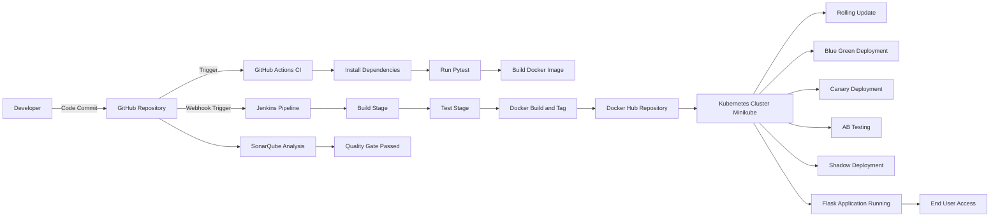
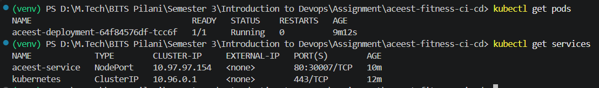
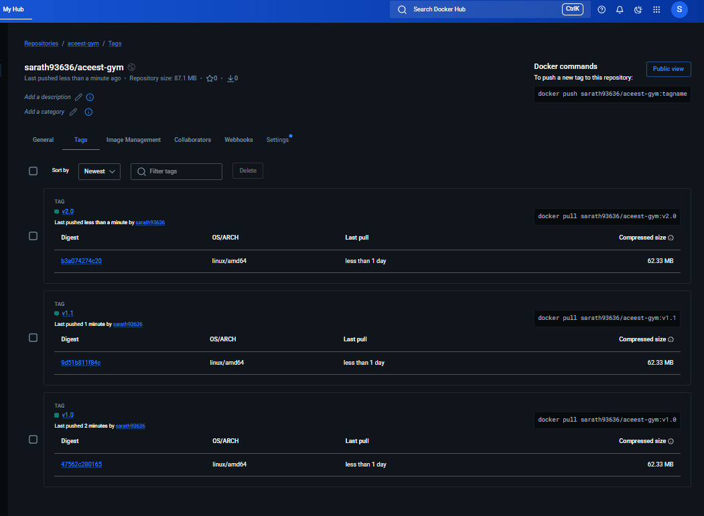
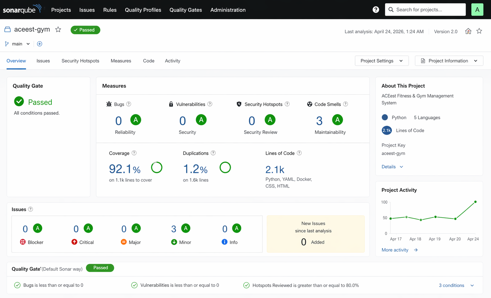

# ACEest Fitness & Gym API – DevOps CI/CD Project


A Flask-based Fitness & Gym Management API demonstrating modern **DevOps practices**, including CI/CD automation, containerization, Kubernetes deployment, and advanced deployment strategies.

---

## 📚 Academic Context

This project is developed as part of the **Introduction to DevOps (SEZG514)** course at **BITS Pilani (WILP)**.

It fulfills the assignment requirement of implementing a **complete end-to-end CI/CD pipeline** with:

- Version Control → Git & GitHub
- CI → GitHub Actions
- Build & CD → Jenkins
- Testing → Pytest
- Containerization → Docker
- Orchestration → Kubernetes (Minikube)
- Code Quality → SonarQube

---

## 🚀 Overview

This project implements a **production-like DevOps lifecycle**:

1. Code development using Flask
2. Version control and branching strategy
3. Automated testing with Pytest
4. Docker-based containerization
5. Continuous Integration via GitHub Actions
6. Continuous Build & Deployment via Jenkins
7. Kubernetes-based deployment
8. Advanced deployment strategies implementation

---

## 📄 Project Documentation

📄 **Full Report (Assignment Submission):**  
[Download Report 1](docs/Report_1.pdf)
[Download Report 2](docs/Report_2.pdf)

---

## ✨ Features

- REST API for gym member & workout management
- Full CRUD operations
- Workout assignment to members
- Member search functionality
- Interactive web dashboard
- Automated testing using Pytest
- Dockerized application
- CI/CD pipelines (GitHub Actions + Jenkins)
- Kubernetes deployment
- Advanced deployment strategies

---

## 🧰 Tech Stack

| Category         | Technology              |
| ---------------- | ----------------------- |
| Backend          | Python, Flask           |
| Frontend         | HTML, CSS, JavaScript   |
| Testing          | Pytest                  |
| Containerization | Docker                  |
| CI/CD            | GitHub Actions, Jenkins |
| Orchestration    | Kubernetes (Minikube)   |
| Code Quality     | SonarQube               |
| Version Control  | Git, GitHub             |

---

## 📁 Project Structure

```

aceest-fitness-ci-cd/
│
├── app.py
├── Dockerfile
├── Jenkinsfile
├── requirements.txt
├── sonar-project.properties
│
├── deployment.yaml
├── service.yaml
├── deployment-blue.yaml
├── deployment-green.yaml
├── canary.yaml
│
├── tests/
├── templates/
├── static/
│
└── .github/workflows/ci.yml

```

---

## 🔗 API Endpoints

### Members

| Method | Endpoint            | Description  |
| ------ | ------------------- | ------------ |
| GET    | `/api/members`      | List members |
| POST   | `/api/members`      | Add member   |
| PUT    | `/api/members/<id>` | Update       |
| DELETE | `/api/members/<id>` | Delete       |

---

## ⚙️ Local Setup

```bash
git clone https://github.com/2024TM93636/aceest-fitness-ci-cd.git
cd aceest-fitness-ci-cd
pip install -r requirements.txt
python app.py
```

---

## 🧪 Running Tests

```bash
pytest
```

---

## 🐳 Docker Setup

```bash
docker build -t sarath93636/aceest-gym:v1.0 .
docker run -d -p 5000:5000 aceest-gym
```

---

## 🔄 CI/CD Pipelines

### GitHub Actions (CI)

- Runs on every push
- Executes tests
- Builds Docker image

### Jenkins (CD)

- Pulls latest code
- Runs tests
- Builds Docker image
- Deploys container

---

## ☸️ Kubernetes Deployment

### Start Cluster

```bash
minikube start
```

### Deploy Application

```bash
kubectl apply -f deployment.yaml
kubectl apply -f service.yaml
```

### Access App

```bash
minikube service aceest-service
```

---

## 🚀 Deployment Strategies Implemented

### 🔹 Rolling Update

Gradual pod updates with zero downtime

### 🔹 Blue-Green Deployment

Two environments (Blue & Green) with traffic switching

### 🔹 Canary Deployment

Small traffic routed to new version

### 🔹 A/B Testing

Multiple versions exposed to users

### 🔹 Shadow Deployment

New version runs in parallel without affecting users

---

## 📊 SonarQube Code Quality

- Static code analysis performed
- Quality gates applied
- Metrics:
  - Bugs
  - Vulnerabilities
  - Code Smells
  - Coverage

---

## 📈 CI/CD Workflow Diagram



---

## 📸 Screenshots

### Dashboard


### GitHub Actions


### Docker Container


### Jenkins


### Kubernetes Pods



### Docker Hub



### SonarQube

## 

## 🛠 DevOps Practices Implemented

- CI/CD automation
- Shift-left testing
- Infrastructure as Code
- Containerized deployments
- Multi-version deployment strategies
- Code quality enforcement

---

## 🔮 Future Enhancements

- Kubernetes production deployment
- Monitoring (Prometheus/Grafana)
- Logging (ELK Stack)
- Authentication system
- Database integration

---

## 👨‍💻 Author

**Sarath Kumar S**
M.Tech – Software Engineering
BITS Pilani (WILP)

GitHub: [https://github.com/2024TM93636](https://github.com/2024TM93636)

---
