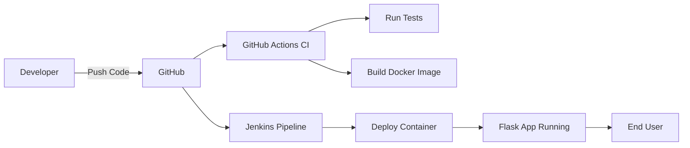

# ACEest Fitness & Gym API – DevOps CI/CD Project


A Flask-based REST API demonstrating DevOps practices including automated testing, Docker containerization, and CI pipelines using GitHub Actions.

## Overview

This project demonstrates the implementation of a **complete DevOps CI/CD pipeline** for a Flask-based Fitness & Gym Management API.

The solution covers the full lifecycle:

- Application development
- Version control
- Automated testing
- Containerization
- Continuous Integration (GitHub Actions)
- Continuous Build & Deployment (Jenkins)

The primary goal is to ensure **code quality, consistency, and automated delivery**.

---

## Features

- REST API for managing gym members
- Add and retrieve members
- Lightweight Flask-based backend
- Fully containerized application
- Automated testing with Pytest
- CI pipeline using GitHub Actions
- Jenkins-based build and deployment pipeline

---

## Tech Stack

| Category         | Technology              |
| ---------------- | ----------------------- |
| Backend          | Python, Flask           |
| Testing          | Pytest                  |
| Containerization | Docker                  |
| CI/CD            | GitHub Actions, Jenkins |
| Version Control  | Git, GitHub             |

---

## Project Structure

```
aceest-fitness-ci-cd/
│
├── app.py                  # Flask API
├── requirements.txt        # Dependencies
├── Dockerfile              # Container configuration
├── Jenkinsfile             # CI/CD pipeline (Jenkins)
├── README.md
│
├── tests/
│   └── test_app.py         # Unit tests
│
└── .github/
    └── workflows/
        └── ci.yml          # GitHub Actions pipeline
```

---

## API Endpoints

### 1. Home

```
GET /
```

Response:

```json
{
  "message": "Welcome to ACEest Fitness & Gym API"
}
```

---

### 2. Get Members

```
GET /members
```

---

### 3. Add Member

```
POST /members
```

Request:

```json
{
  "name": "John"
}
```

Response:

```json
{
  "message": "Member added successfully"
}
```

---

## Local Setup

### 1. Clone Repository

```
git clone https://github.com/2024TM93636/aceest-fitness-ci-cd.git
cd aceest-fitness-ci-cd
```

### 2. Install Dependencies

```
pip install -r requirements.txt
```

### 3. Run Application

```
python app.py
```

Access:

```
http://localhost:5000
```

---

## Running Tests

```
pytest
```

---

## Docker Setup

### Build Image

```
docker build -t aceest-gym .
```

### Run Container

```
docker run -p 5000:5000 aceest-gym
```

---

## CI/CD Pipelines

### GitHub Actions (Continuous Integration)

Triggered on every push to `main`.

Steps:

1. Checkout code
2. Setup Python
3. Install dependencies
4. Run tests
5. Build Docker image

---

### Jenkins Pipeline (Build & Deployment)

The Jenkins pipeline performs:

1. Environment setup using Docker agent
2. Dependency installation
3. Test execution
4. Docker image build
5. Container deployment

This ensures:

- Code validation
- Build consistency
- Automated deployment

---

## CI/CD Workflow Diagram



---

## DevOps Practices Implemented

- Version control with structured commits
- Automated testing (shift-left testing)
- Containerized application deployment
- Continuous Integration (CI)
- Continuous Build & Deployment (CD)
- Infrastructure as Code (Dockerfile, Jenkinsfile, YAML)

---

## Improvements & Future Enhancements

- Add database integration (e.g., PostgreSQL)
- Input validation for API
- Authentication & authorization
- Logging and monitoring
- Docker image optimization using multi-stage builds
- Kubernetes deployment

---

## Author

Sarath Kumar S
M.Tech – Software Engineering
BITS Pilani (WILP)

---
